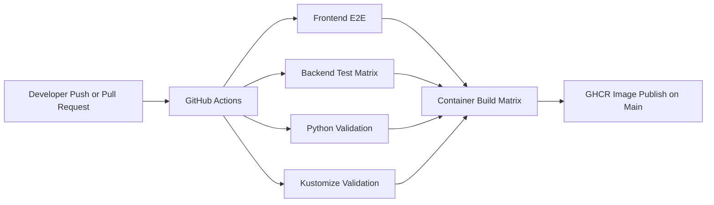
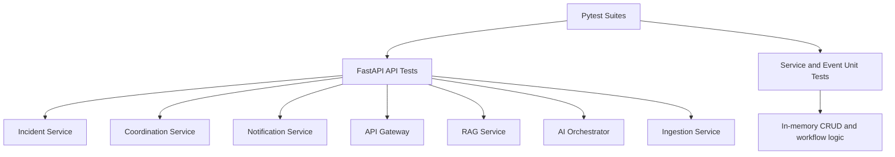

# Phase 10 Architecture

This document explains the Phase 10 backend quality and container automation work in simple terms.

## What changed in Phase 10
Phase 9 added continuous integration.
Phase 10 makes that pipeline more useful by adding backend test coverage and automated container image build and release logic.

## Goal
Protect the backend services with repeatable tests and turn container packaging into an automatic pipeline step.

## Why this phase matters
At this point the platform has:
- multiple FastAPI services
- a frontend test suite
- Kubernetes manifests
- Dockerfiles for all deployable parts

Without backend tests, service regressions are easy to miss.
Without automated image builds, release steps stay manual and inconsistent.

## What Phase 10 adds
- pytest-based backend API tests for the FastAPI services
- unit tests for important in-memory service and event-handling logic
- a shared Python test dependency file
- a CI backend test matrix
- a CI container image build and release matrix

## Diagram: quality and release pipeline

## Diagram: backend testing structure

## Backend testing approach
The backend tests are split into two layers.

### 1. API tests
These tests call FastAPI endpoints with `TestClient`.

They verify things like:
- health endpoints
- CRUD behavior
- response status codes
- request and response shapes
- gateway error handling

### 2. Unit tests
These tests call internal service classes and event handlers directly.

They verify things like:
- incident store mutations
- task generation from incident events
- notification creation from Kafka event payloads
- RAG document and search behavior with mocked repository calls
- AI workflow fallback behavior when no LLM response is available

## Why per-service test folders are used
Each Python service uses an `app` package name.

Running tests inside each service directory avoids package-name collisions between services and keeps the import paths simple.

## CI backend test matrix
The CI workflow runs backend tests as a matrix across services.

That means:
- each service installs its own requirements
- each service runs its own `pytest` suite
- failures are isolated to the service that broke

## Container build and release automation
The CI workflow now builds every deployable image automatically.

### On pull requests
CI builds each image to verify the Dockerfiles still work.

### On pushes to `main` or `master`
CI logs into GHCR and publishes the images.

This keeps image release tied to validated code instead of manual local builds.

## Images covered by the pipeline
- frontend web
- api gateway
- incident service
- coordination service
- notification service
- ingestion service
- rag service
- ai orchestrator

## Why GHCR is used
GitHub Container Registry fits naturally with GitHub Actions because:
- authentication works with `GITHUB_TOKEN`
- image publishing can stay in the same workflow system
- versioned images can be tied directly to commits and branches

## What this phase teaches
- how to test FastAPI services at API and unit levels
- how to isolate service tests in a monorepo
- how to use CI matrices for backend validation
- how to automate container builds and controlled image publishing

## What comes after Phase 10
Natural follow-ups are:
- contract tests between services
- smoke tests against a running local Kubernetes cluster
- deployment promotion workflows
- rollback-aware release automation
