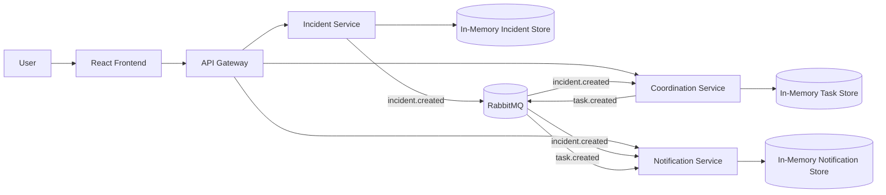
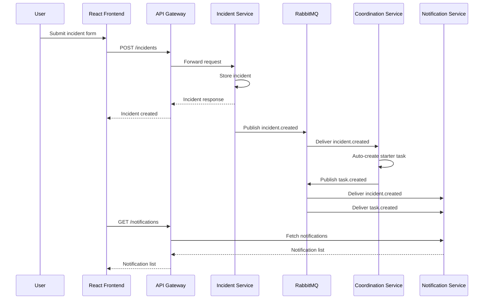
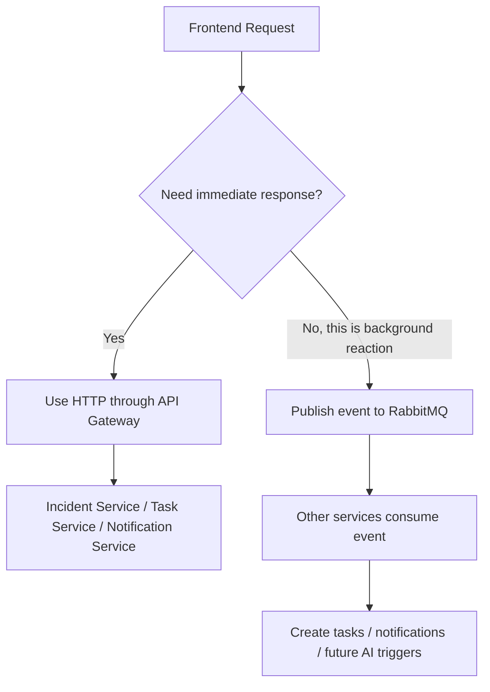

# Phase 3 Architecture

This document explains the Phase 3 event-driven flow in a simple way.

## What changed in Phase 3
Before Phase 3, the system was mainly request-response:
- React called the gateway
- the gateway called backend services
- services returned data immediately

In Phase 3, we added RabbitMQ so services can also communicate through events.

## Main idea
When a new incident is created:
1. the incident service stores the incident
2. the incident service publishes `incident.created`
3. the coordination service consumes that event
4. the coordination service creates a starter task
5. the coordination service publishes `task.created`
6. the notification service consumes both events
7. the frontend shows notifications through the gateway

## Diagram: system overview

## Diagram: incident event flow

## Diagram: HTTP vs event flow

## Why this matters
This is important because the system becomes more modular.

The incident service does not need to directly know:
- how tasks are created
- how notifications are created

It only says:
- "an incident was created"

Other services decide what to do with that event.

## Services in Phase 3
### Frontend
- React dashboard
- shows incidents, tasks, notifications

### API Gateway
- single entry point for the frontend
- forwards HTTP calls to backend services

### Incident Service
- stores incidents
- publishes `incident.created`

### Coordination Service
- stores tasks
- consumes `incident.created`
- publishes `task.created`

### Notification Service
- consumes `incident.created`
- consumes `task.created`
- stores notification records

### RabbitMQ
- message broker between services

## Communication styles
### Synchronous communication
Used when the frontend needs an immediate response.

Examples:
- list incidents
- create incident
- list tasks
- list notifications

### Asynchronous communication
Used when backend services react to business events.

Examples:
- `incident.created`
- `task.created`

## Why both styles exist together
A real system often uses both:
- HTTP for direct user actions
- RabbitMQ for background reactions and decoupled workflows

## Design pattern in simple words
### Request-response pattern
Good for:
- forms
- fetching data
- direct updates

### Event-driven pattern
Good for:
- triggering downstream work
- reducing tight coupling
- making the system easier to grow

## What this prepares us for later
Phase 3 prepares the project for:
- RAG triggers
- AI workflow triggers
- audit logging
- analytics and reporting
- more services reacting to the same incident event

## Simple learning summary
Phase 3 teaches:
- why queues matter
- how events connect microservices
- how one action can trigger many downstream actions
- why gateways and brokers serve different purposes
