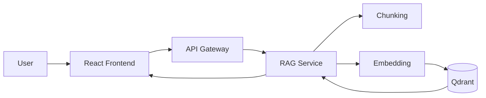
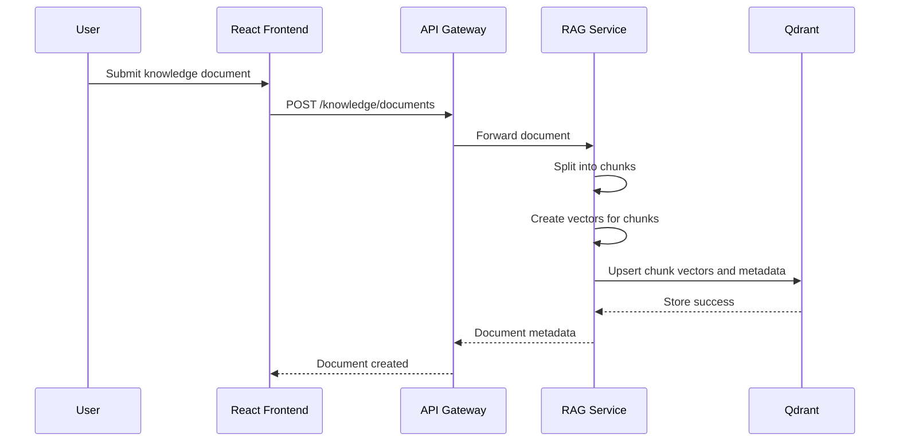
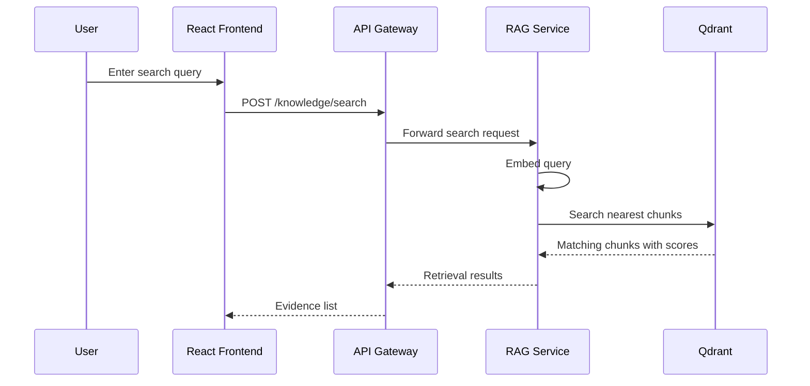
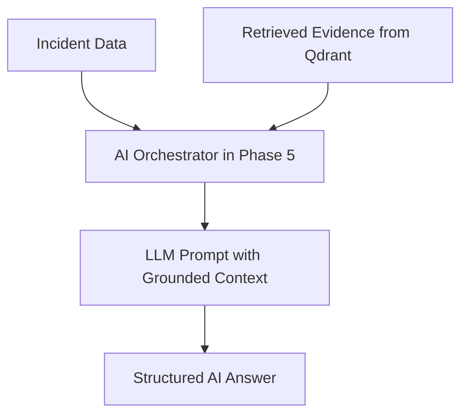

# Phase 4 Architecture

This document explains the Phase 4 RAG flow in a simple way.

## What changed in Phase 4
Phase 3 gave the system event-driven behavior using Kafka.
Phase 4 adds a knowledge base so the platform can retrieve useful evidence before Phase 5 starts generating AI answers.

## Main idea
When a user adds a knowledge document:
1. the frontend sends the document to the gateway
2. the gateway forwards it to the rag-service
3. the rag-service chunks the text
4. each chunk is converted into a vector
5. the vectors are stored in Qdrant

When a user searches:
1. the frontend sends a retrieval query
2. the rag-service converts the query into a vector
3. Qdrant returns similar chunks
4. the frontend shows those evidence chunks

## Diagram: RAG system overview

## Diagram: knowledge ingestion flow

## Diagram: knowledge retrieval flow

## Diagram: relation to Phase 5

## Why this matters
This phase separates retrieval from generation.
That is important because RAG has two major parts:
- retrieval
- generation

Right now we are only building retrieval. That keeps the design simple.

## Services in Phase 4
### Frontend
- document ingestion form
- knowledge search form
- search results panel

### API Gateway
- forwards knowledge document requests
- forwards search requests

### RAG Service
- chunking
- local embeddings
- Qdrant storage
- Qdrant search

### Qdrant
- vector database
- stores chunk vectors and metadata

## Why the embedding is local and simple
For the student MVP, the embedding step uses a small hash-based embedding function.
This is useful because:
- it is free
- it is simple to understand
- it keeps Phase 4 focused on the RAG pipeline

Later we can swap it with a stronger embedding model.

## Communication pattern in Phase 4
Phase 4 mainly uses synchronous HTTP.
That is because document ingestion and retrieval are direct user actions.

Kafka from Phase 3 still exists, but it is not the main part of this phase.

## What this prepares us for
Phase 4 prepares Phase 5 because the AI orchestrator will need:
- relevant evidence chunks
- source metadata
- incident-type filtering
- reusable retrieval endpoints
