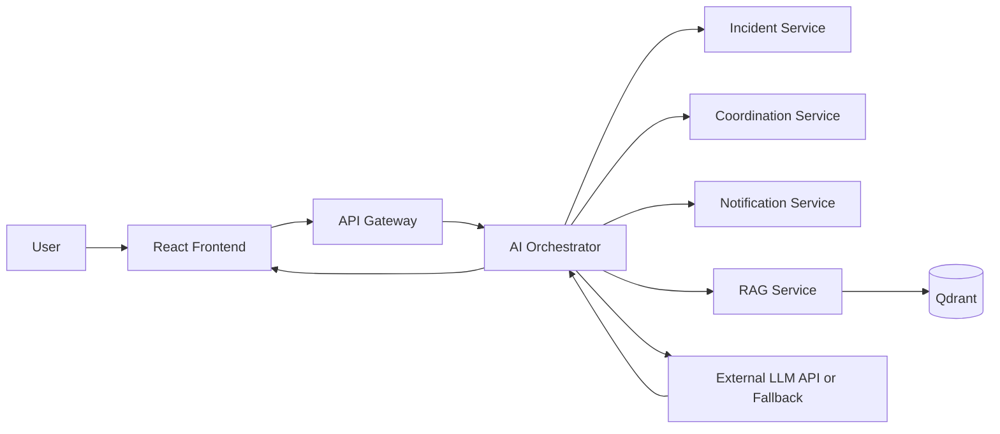
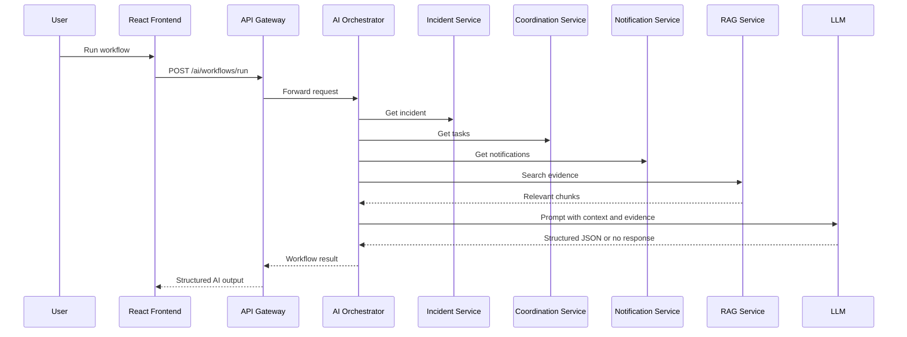
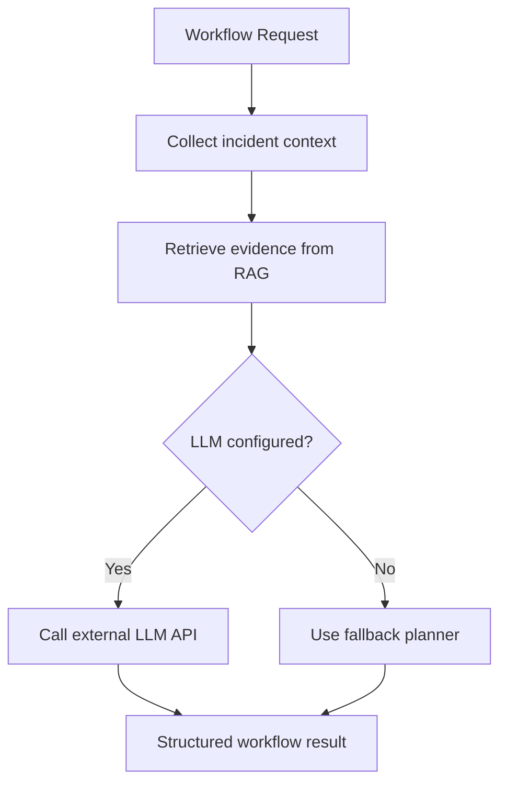
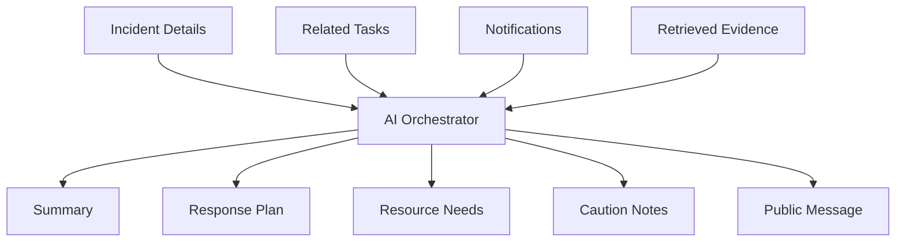

# Phase 5 Architecture

This document explains the Phase 5 AI orchestration flow in a simple way.

## What changed in Phase 5
Phase 4 gave the system retrieval with Qdrant.
Phase 5 adds an AI orchestrator that combines:
- incident context
- related tasks
- notifications
- retrieved evidence
- an LLM or fallback logic

## Main idea
When a workflow runs:
1. the frontend sends a workflow request
2. the gateway forwards it to the AI orchestrator
3. the AI orchestrator fetches incident data
4. the AI orchestrator fetches related tasks and notifications
5. the AI orchestrator searches the RAG service for evidence
6. the AI orchestrator builds a structured prompt
7. the LLM is called if credentials are present
8. otherwise fallback logic is used
9. the frontend shows the structured result

## Diagram: orchestration overview

## Diagram: workflow sequence

## Diagram: fallback decision

## Diagram: orchestration inputs and outputs

## Why this matters
This phase introduces the difference between:
- a direct prompt
- a real workflow

A workflow is better because it has clear steps and known inputs.

## Workflow types in this phase
- triage
- response_plan
- public_advisory

## Why fallback mode exists
The project should still work without paid API usage.
Fallback mode makes the architecture testable even when no LLM key is configured.

## Simple architecture roles
### Frontend
- lets the user run workflows
- displays summaries, plans, cautions, and evidence

### API Gateway
- forwards AI workflow requests

### AI Orchestrator
- central workflow engine
- gathers context
- reuses RAG
- calls LLM or fallback
- stores workflow run history in memory

### RAG Service
- provides evidence chunks

### Incident / Coordination / Notification Services
- provide structured operational context

## What this prepares for later
Phase 5 makes it easy to add:
- tool calling
- approval flows
- automatic task suggestions
- richer agents
- audit logs and AI analytics
