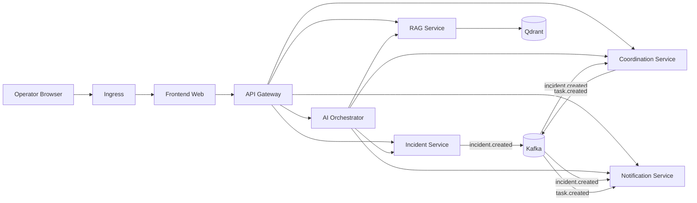
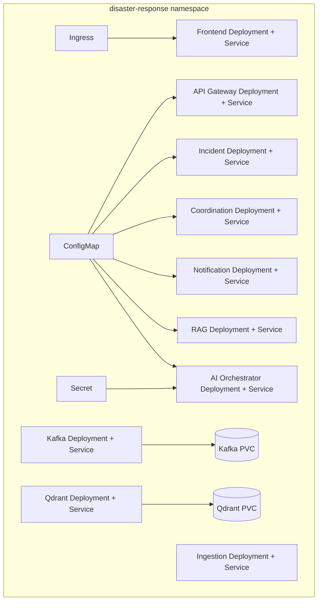
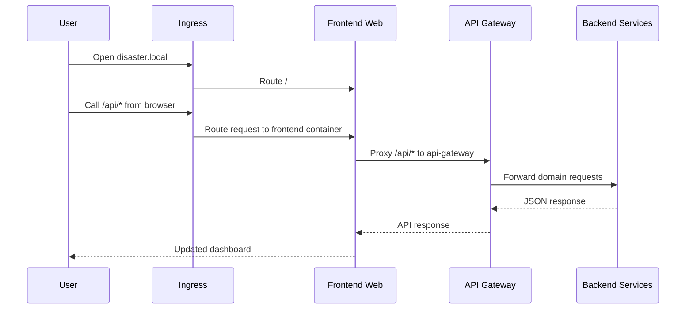

# Phase 6 Architecture

This document explains the Phase 6 Kubernetes deployment in a simple way.

## What changed in Phase 6
Phase 5 completed the application flow.
Phase 6 packages the platform so the services can run together inside a local Kubernetes cluster.

## Main idea
The deployment keeps the same service boundaries from earlier phases and adds:
- container images for each service
- cluster networking through Kubernetes Services
- shared runtime configuration through ConfigMaps and Secrets
- persistent storage for Kafka and Qdrant
- ingress for browser access

## Diagram: cluster overview

## Diagram: Kubernetes building blocks

## Diagram: request path from browser to services

## Runtime configuration
### ConfigMap
The shared ConfigMap provides:
- service-to-service base URLs
- Kafka bootstrap server, topic, and consumer-group settings
- Qdrant settings
- default LLM base URL and model name

### Secret
The Secret provides:
- `LLM_API_KEY`

The base manifest leaves this empty so the AI orchestrator starts in fallback mode by default.

## Persistent components
### Kafka
Kafka runs as a three-broker KRaft StatefulSet in the local cluster so the deployment uses Kafka's distributed broker model rather than a single standalone node.

Each broker stores state on its own persistent volume claim so topic data survives pod restarts.

### Qdrant
Qdrant stores the vector index on a persistent volume claim so ingested knowledge remains available.

## Why this matters
Phase 6 makes the project easier to:
- run as one environment
- demo reliably
- move toward production-style operations
- keep infrastructure concerns separate from application code

## Deployment scope
Phase 6 covers local-cluster deployment for:
- frontend web
- API gateway
- incident service
- coordination service
- notification service
- RAG service
- AI orchestrator
- ingestion service
- Kafka
- Qdrant

## What comes after Phase 6
The next improvements would typically be:
- image publishing to a registry
- environment overlays for dev and prod
- external secret management
- observability and metrics
- autoscaling
