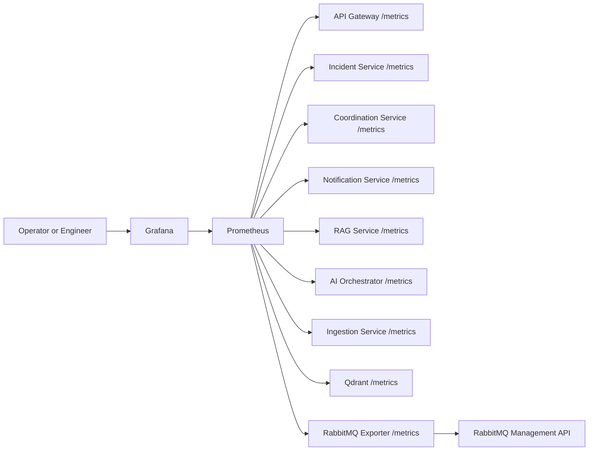
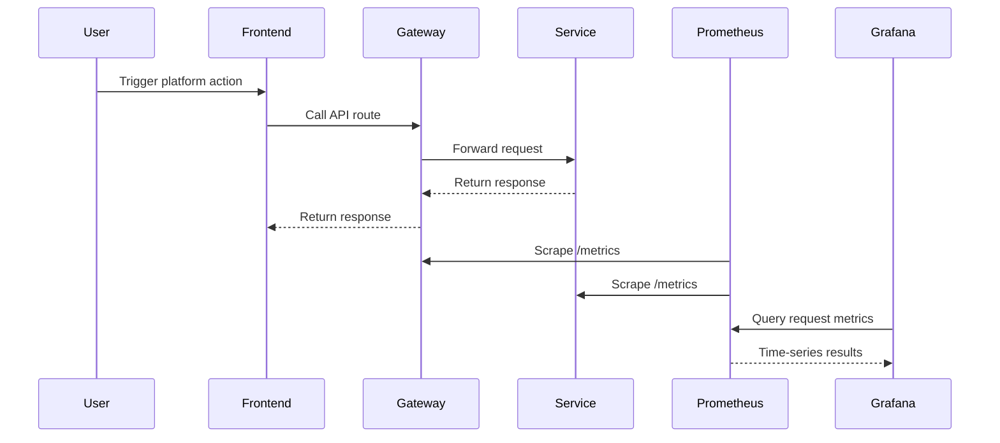
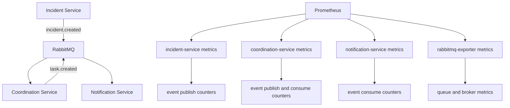

# Phase 7 Architecture

This document explains the Phase 7 observability layer in a simple and detailed way.

## What changed in Phase 7
Phase 6 made the platform deployable on Kubernetes.
Phase 7 makes the running system observable.

That means the platform can now answer questions like:
- which service is receiving traffic right now?
- how fast are requests completing?
- which workflows are running in `llm` mode versus `fallback` mode?
- how many incidents, tasks, notifications, and documents are currently in memory?
- are events being published and consumed as expected?
- is RabbitMQ healthy and are queues growing?

## Main idea
Phase 7 adds four layers:
1. application metrics inside each FastAPI service
2. infrastructure metrics from RabbitMQ and Qdrant
3. Prometheus for scraping and storing metrics
4. Grafana for dashboards and operational visibility

## Diagram: observability overview

## Diagram: application request monitoring flow

## Diagram: event monitoring flow

## What each component does

### 1. FastAPI service metrics
Each Python service now exposes `GET /metrics`.

The `/metrics` endpoint returns Prometheus-formatted text. Prometheus reads that output on a schedule and stores the values as time series.

### 2. Prometheus
Prometheus does three jobs:
- scrapes metrics endpoints
- stores recent metric history
- answers metric queries from Grafana

It does not render dashboards by itself very well. That is why Grafana sits on top of it.

### 3. Grafana
Grafana reads from Prometheus and renders dashboards.

In this phase, Grafana is provisioned automatically with:
- a Prometheus data source
- a dashboard provider
- a platform overview dashboard

### 4. RabbitMQ exporter
RabbitMQ does not expose the exact Prometheus format needed by the dashboard stack in the current setup.

The exporter connects to the RabbitMQ management API and converts broker data into Prometheus metrics.

That gives visibility into broker behavior such as:
- queue depth
- message activity
- consumer visibility

### 5. Qdrant metrics
Qdrant is scraped directly by Prometheus.

That makes it possible to observe the health of the vector database alongside the application services.

## What the service metrics mean

### HTTP metrics
Every FastAPI service records:
- total HTTP requests by method, route, and status code
- HTTP request duration as a histogram

These answer questions like:
- which endpoint is busiest?
- which service is slowest?
- how many 4xx or 5xx responses are happening?

### Domain metrics
Some services also record business-level metrics.

#### Incident Service
Tracks:
- incident create, update, and delete counts
- current number of incidents in memory
- published event success and failure counts

#### Coordination Service
Tracks:
- task create, update, and delete counts
- current number of tasks in memory
- consumed `incident.created` events
- published `task.created` events

#### Notification Service
Tracks:
- notification creation counts by source event and level
- current number of notifications in memory
- consumed event counts

#### RAG Service
Tracks:
- ingested document counts
- indexed chunk counts
- current document metadata count
- search request counts
- search result counts per query

#### API Gateway
Tracks:
- its own HTTP traffic
- downstream HTTP calls to backend services
- downstream request duration

This helps answer whether latency is inside the gateway itself or in a service behind it.

#### AI Orchestrator
Tracks:
- workflow runs by type and mode
- workflow duration
- current workflow history size
- downstream calls to incident, task, notification, and RAG services

This is especially useful for comparing `fallback` and `llm` behavior.

## How the middleware works
Each FastAPI service uses a small metrics middleware.

For every request except `/metrics`, the middleware:
1. records the start time
2. lets the route execute
3. captures the final status code
4. increments a request counter
5. observes the duration in a histogram

The histogram matters because it supports latency percentiles such as p95.

## Why counters and gauges are both used

### Counter
A counter only goes up.

Examples:
- total incidents created
- total notifications created
- total workflow runs
- total published events

Use a counter when the question is: *how many times has this happened?*

### Gauge
A gauge can go up or down.

Examples:
- current incidents in memory
- current tasks in memory
- current workflow history size

Use a gauge when the question is: *how many are there right now?*

### Histogram
A histogram groups observed values into buckets.

Examples:
- request duration
- workflow duration
- number of search matches returned

Use a histogram when the question is: *how long did it take?* or *how large was the result?*

## Why Prometheus scrapes instead of services pushing metrics
This phase uses the Prometheus pull model.

That means Prometheus reaches out to each service on a schedule.

This is useful because:
- the services stay simple
- Prometheus controls scrape frequency
- configuration stays centralized
- Kubernetes service names make targets stable

## What the Grafana dashboard shows
The provisioned dashboard focuses on the most important operational questions.

### HTTP request rate
Shows how much traffic each service is receiving over time.

### HTTP latency p95
Shows slower requests without being distorted by average-only views.

### Event throughput
Shows publishing and consuming activity for the RabbitMQ-driven workflow.

### AI workflow throughput and latency
Shows how often AI workflows run and how long they take.

### In-memory entity counts
Shows current counts for incidents, tasks, notifications, documents, and workflow history.

### Scrape health
Uses the `up` metric to show whether Prometheus can currently scrape each target.

### Knowledge and notification activity
Shows RAG search activity, chunk indexing activity, and notification creation rate.

## Kubernetes layout for Phase 7
The monitoring stack is separated into its own Kustomize package.

### Application stack
Lives in:
- `infra/k8s/base`

### Monitoring stack
Lives in:
- `infra/k8s/monitoring`

That separation is useful because the platform can be deployed first and monitoring can be added after.

## Access pattern
The monitoring ingress exposes:
- `grafana.disaster.local`
- `prometheus.disaster.local`

The application ingress from Phase 6 still exposes the main frontend at:
- `disaster.local`

## What to look for during operations
A typical operational check now becomes:
1. open Grafana
2. check the `up` panel to see whether all targets are reachable
3. check request rate and p95 latency
4. check event throughput for publish/consume balance
5. check AI workflow duration and mode usage
6. check whether queue metrics or service metrics show backpressure

## Simplifications in this phase
This phase is intentionally simple in a few places:
- metrics are process-local and reflect in-memory state
- Grafana uses default credentials in the base manifest
- Prometheus keeps short local retention only
- alert rules are not yet added
- tracing and log aggregation are not part of this phase

Those can become later phases without changing the basic metrics design.

## What Phase 7 prepares for next
This phase prepares the project for:
- alerting rules
- log aggregation
- distributed tracing
- performance tuning
- resilience analysis
- CI validation against latency and error budgets
