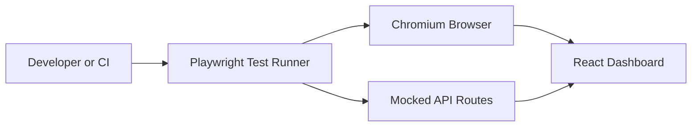
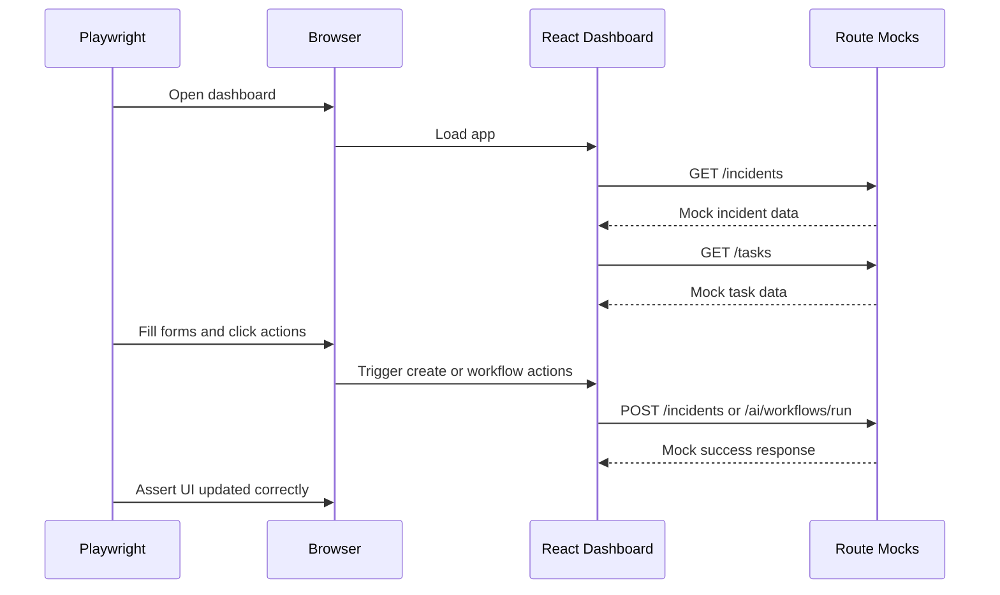

# Phase 8 Architecture

This document explains the Phase 8 automated testing layer in a simple way.

## What changed in Phase 8
Phase 7 made the platform observable in production-style runtime conditions.
Phase 8 adds automated checks so the project can verify important user flows before changes are merged or released.

## Goal
Test the platform automatically instead of relying only on manual clicking.

For this phase, the testing stack focuses on the frontend dashboard and its main user workflows using Playwright.

## Why this phase matters
As the project grows, manual testing becomes unreliable because:
- the dashboard has multiple forms and data panels
- workflows depend on several API calls
- regressions become easy to miss after UI and service changes

Automated tests make the platform safer to change.

## Main idea
Phase 8 adds:
- Playwright as the end-to-end browser test runner
- a repeatable local test command in the frontend workspace
- API mocking inside the Playwright tests so the dashboard can be tested without needing every backend service running
- a documented testing architecture for future expansion into API and integration tests

## Diagram: testing overview

## Diagram: test execution flow

## Why Playwright
Playwright is used because it is strong at:
- real browser testing
- modern frontend workflows
- stable selectors and assertions
- local development and CI use
- request interception and mocking

That last point matters here because the dashboard depends on many backend calls.

## What is tested in this phase
The current automated coverage checks three important behaviors:

### 1. Dashboard load
The test verifies that the app loads with seeded incident, task, and notification data.

### 2. Incident creation flow
The test fills the incident form, submits it, and confirms the new incident appears in the incident list.

### 3. AI workflow flow
The test runs the AI workflow action and confirms the latest AI result panel updates with the returned structured output.

## Why API mocking is used
This phase uses mocked API routes inside the Playwright tests.

That means the tests do not require:
- all backend services to be started
- Kafka to be running
- Qdrant to be running
- Kubernetes to be running

This is intentional.

It keeps the first automated testing phase focused on frontend behavior and user flows.

## What the mocks simulate
The test suite simulates:
- incident list and incident creation
- task list and task creation
- notification list
- knowledge document list and upload
- knowledge search
- AI workflow runs and workflow history

## Test architecture choice
Phase 8 is a browser-focused test layer, not a full integration environment yet.

That is a good first step because it provides:
- fast feedback
- deterministic results
- low setup cost

A later testing phase can expand into:
- service unit tests
- API integration tests
- local cluster smoke tests
- contract tests across services

## Files added in this phase
### Playwright configuration
Defines the browser test setup and starts the Vite development server automatically.

### End-to-end tests
Defines the automated dashboard scenarios.

## How the test runner works
When `npm run test:e2e` runs:
1. Playwright starts the Vite dev server
2. it opens the dashboard in a browser
3. it intercepts API requests with mocked responses
4. it performs user actions
5. it checks that the UI updates correctly

## Why this is useful before the next phases
This phase gives the project a safety net.

That makes later work safer in areas like:
- authentication
- persistence
- resilience features
- UI refactors
- deployment changes

## What comes after Phase 8
Natural follow-ups are:
- pytest-based backend tests
- API integration tests against real services
- local Kubernetes smoke tests
- CI execution for Playwright on every change
