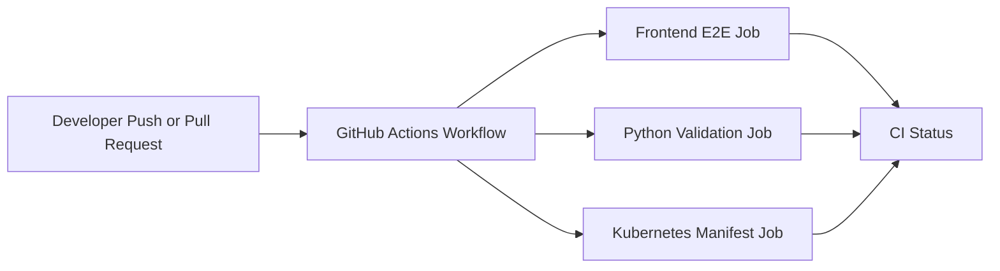
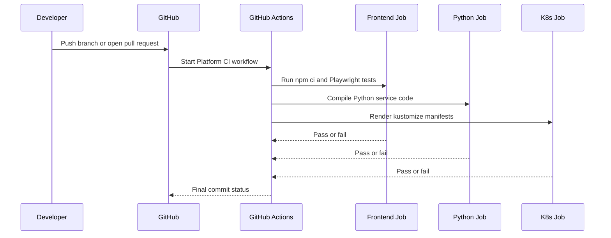

# Phase 9 Architecture

This document explains the Phase 9 continuous integration layer in simple terms.

## What changed in Phase 9
Phase 8 added automated browser tests.
Phase 9 makes those checks run automatically in GitHub Actions so the project can catch problems before code is merged.

## Goal
Turn manual validation steps into an automatic pipeline.

## Why this phase matters
After adding tests, the next problem is consistency.
If checks only run on one machine, they are easy to skip.

Continuous integration solves that by running the same validation steps for every push and pull request.

## What Phase 9 adds
- a GitHub Actions workflow in `.github/workflows/ci.yml`
- an automated frontend test job for Playwright
- an automated Python service validation job
- an automated Kubernetes manifest rendering job
- a small reusable Python validation script in `scripts/ci/validate_python_services.py`

## Diagram: CI overview

## Diagram: pipeline flow

## How each job works

### 1. Frontend E2E job
This job:
- installs Node.js
- installs frontend dependencies
- installs the Playwright Chromium browser
- runs the dashboard browser tests

Why it exists:
It protects the user-facing flows that were added in Phase 8.

### 2. Python service validation job
This job:
- sets up Python
- runs a repository script that compiles each service app directory

Why it exists:
It catches syntax and import-level mistakes early, especially when multiple services change at once.

### 3. Kubernetes manifest validation job
This job:
- installs `kubectl`
- renders `infra/k8s/base`
- renders `infra/k8s/monitoring`

Why it exists:
It confirms that the deployment manifests still build correctly after infrastructure edits.

## Why compile Python instead of full service startup
This phase keeps the backend check lightweight.

That means CI can validate:
- Python syntax
- module structure
- broken code introduced by edits

Without needing to boot:
- Kafka
- Qdrant
- Kubernetes
- every FastAPI service dependency chain

This keeps the first CI phase fast and stable.

## Why render Kubernetes manifests instead of applying them
CI should validate the manifest structure without depending on a live cluster.

Rendering with `kubectl kustomize` is enough to catch:
- missing files
- bad kustomization references
- broken YAML composition

## Architecture choice
Phase 9 is focused on continuous integration, not full delivery automation yet.

That is intentional.

First make sure the project can prove it is healthy.
Then later phases can add:
- container image publishing
- deployment automation
- environment promotion
- release workflows

## Files added in this phase
### `.github/workflows/ci.yml`
Defines the automated CI workflow.

### `scripts/ci/validate_python_services.py`
Provides a simple, repeatable Python validation step used by CI.

## What this phase teaches
- how CI pipelines are structured
- why checks should run automatically
- how to separate frontend, backend, and infrastructure validation
- how to keep pipelines useful without making them too heavy

## What comes after Phase 9
Natural follow-ups are:
- backend unit and API tests
- container image build validation
- automated deployment to the local Kubernetes workflow
- release and rollback automation
